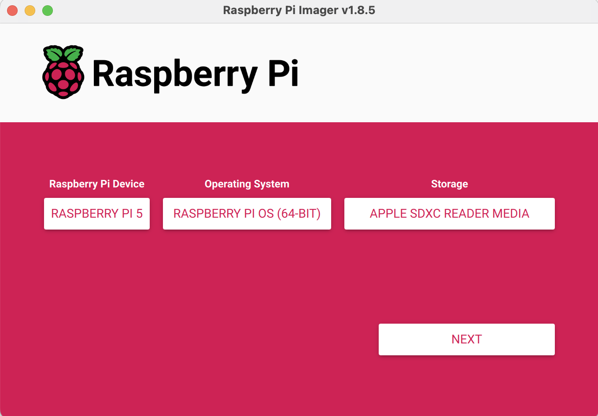
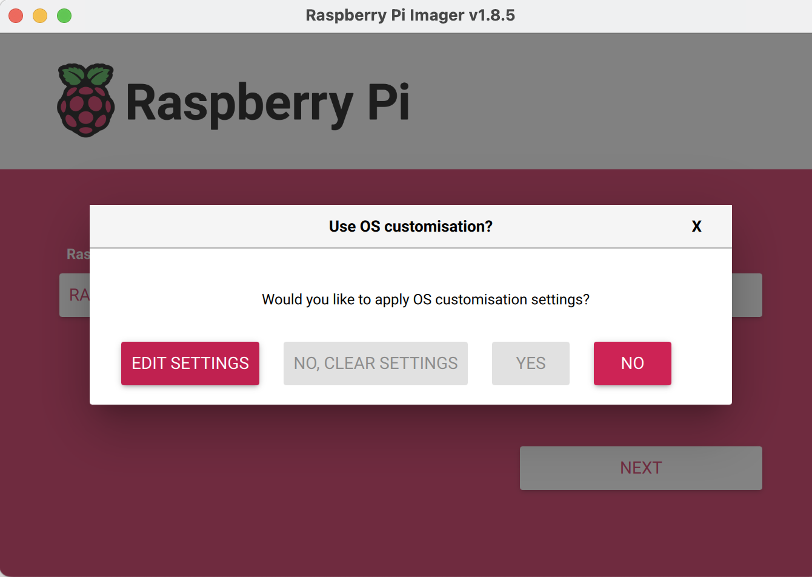
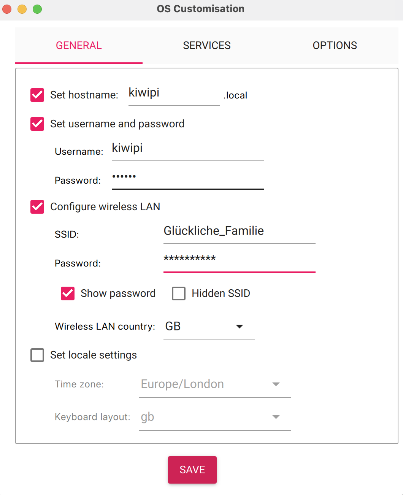
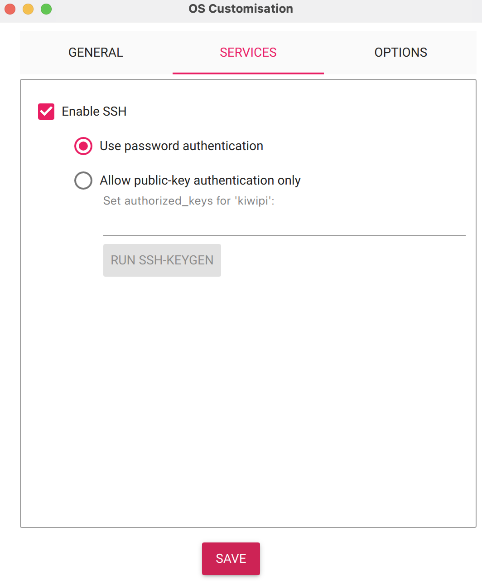
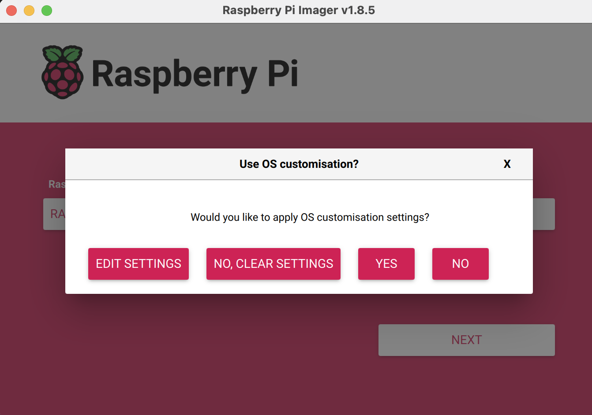
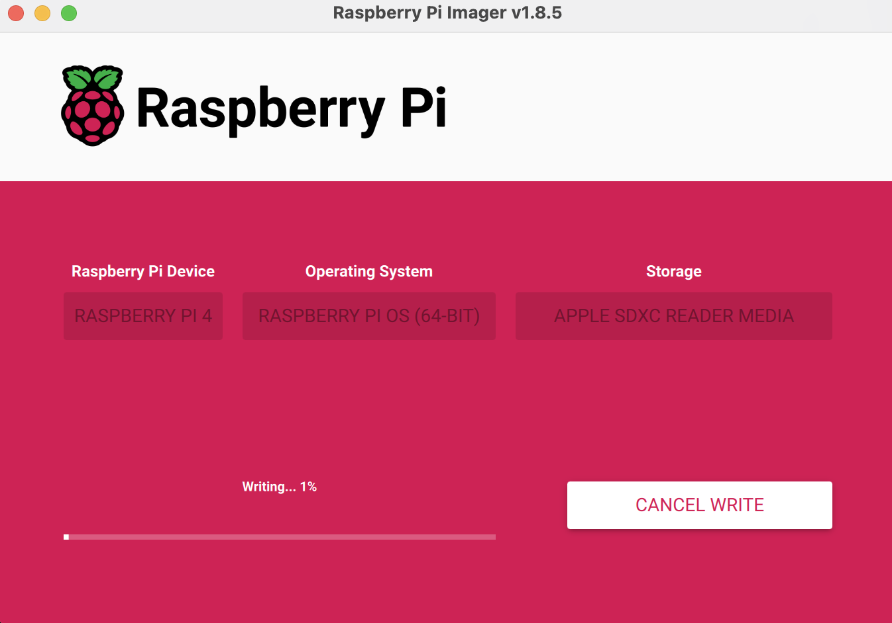
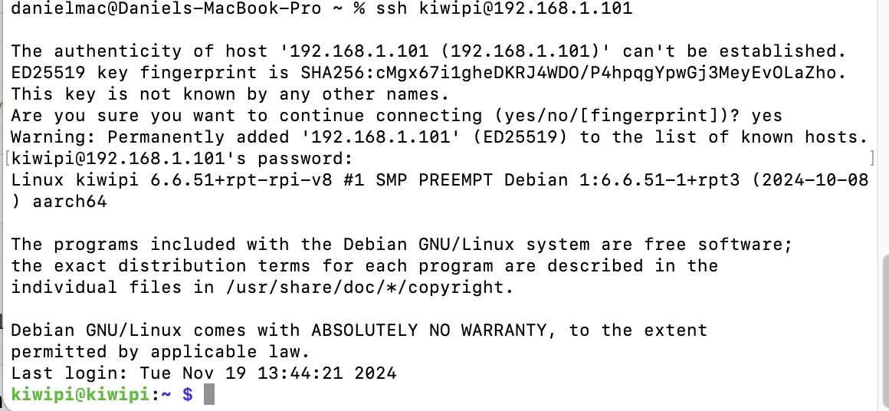

# rpi_youtube_streamer

## Step 1: Buy Raspberry Pi hardware kit
https://thepihut.com/products/raspberry-pi-5-starter-kit

Additionally:
- A screeen/TV with HDMI port to connect to the rpi
- A USB dongle that can connect SD card to your PC

## Step 2: Load operating system to the SD card
1. Download the rpi imager at:
https://www.raspberrypi.com/software/

2. Open the imager, then select the correct rpi device that you are using, select rpi os (64-bit), and select the SD card you plugged into your computer.


3. Click "NEXT", then click "EDIT SETTING"


4. In "GENERAL" tab, set your hostname, username and password. You must configure your wireless LAN for your rpi to be able to connnect to your wifi network. The country needs to match the country you are physically in (important).


5. Enable SSH in SERVICES, you can use password that you set in "GENERAL" for SSH log in. 

6. Then hit "SAVE", and "YES", "YES"

7. Now imager will load OS into the SD card

8. Eject the SD card when done

## Step 3: Plug SD card into rpi, and boot up
1. Open terminal on PC, to check all deviced connected to your wifi
```
arp -a
```

2. Wait until your rpi has booted up (2 minute)
3. On PC, check all deviced connected to your wifi again, now the additional one will be the rpi that just connected to wifi.
```
arp -a
```
In my case my rpi has an ip address of 192.168.1.101

4. On PC, SSH into your rpi using this command. type "yes" and enter, when first time connecting
```
ssh kiwipi@192.168.1.101
```
Successful ssh connection looks like this:


## Step 4: Set screen resolution to 720P

## Step 5: Set audio output to HDMI

## Step 6: Install mpv and yt-dlp

```
sudo apt update
```

```
sudo apt install mpv -y
```


clean install yt-dlp newest version
```
sudo apt remove yt-dlp -y
```
```
sudo curl -L https://github.com/yt-dlp/yt-dlp/releases/latest/download/yt-dlp -o /usr/local/bin/yt-dlp
sudo chmod a+rx /usr/local/bin/yt-dlp
```

## Step 7: Create a script to easily stream
```
nano ~/ytplay
```

Paste this inside
```
#!/bin/bash
mpv --fs --ytdl-format="bestvideo[vcodec^=avc1][height<=1080]+bestaudio[acodec^=mp4a]/best[height<=1080][vcodec^=avc1]" "$1"

```
ctrl-o to write out, and enter
ctrl-x to exit nano

Then move this to path
```
chmod +x ~/ytplay
sudo mv ~/ytplay /usr/local/bin/
```

Try:
```
ytplay https://youtu.be/20cw8FH6me0?si=oC7jNOZg3zsnzYrTnan
```


